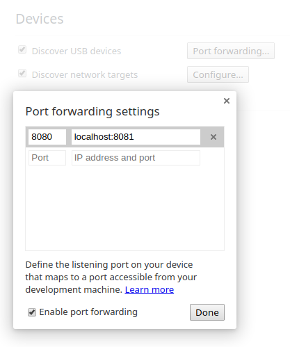
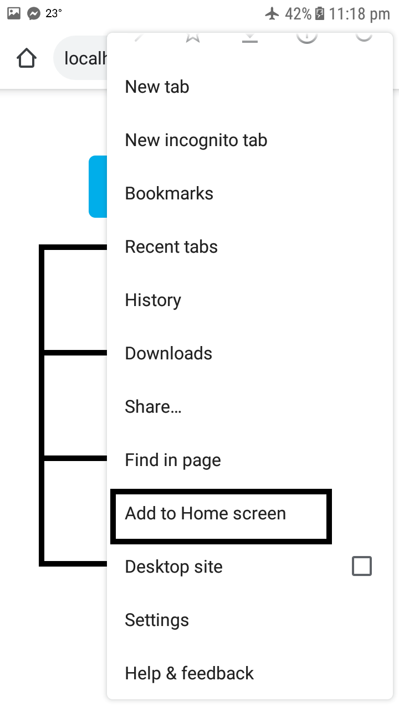

# Tic Tac Toe PWA

Tic Tac Toe as a Progressive Web App.
  
## Usage

Clone the repo and install the dependencies.
```
npm install
```

Start the server and play.
```
npm run start
```

**To install on a device**

  01. Connect device to PC via USB cable.

  02. On PC open `chrome://inspect/#devices` in Google Chrome.
      
  03. Click on port forwarding, enable it and create a port to url mapping. 
    
    
  04. On the connected device open `localhost:<entered port>` or based on above image `localhost:8080`.

  05. An app install banner will appear, click to install.
    
    
  06. If app install banner does not appear, at the top right click the 'More' button(3 dots) and then click on Add to
  Home screen to install.
    


